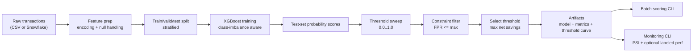

# Technical Document: Fraud / Risk Scoring Model

## 1. Purpose and Scope

This document is a full technical specification of the repository. It is written so an engineer can:

- Understand every component in the codebase.
- Rebuild the system from scratch with the same behavior.
- Operate the model lifecycle end-to-end (train, threshold, score, monitor, test, CI).

Project goal:

- Build a binary fraud model using XGBoost.
- Convert model probabilities into decisions using an explicit business constraint: `false_positive_rate <= 2%`.
- Optimize decision threshold for business value (`net_savings`) instead of only pure ranking metrics.
- Support warehouse-native data pulls from Snowflake and practical monitoring with drift metrics.

---

## 2. High-Level Architecture



Core design choice:

- The model outputs a score.
- A separate threshold policy turns score into approve/decline decisions.
- Threshold policy is constrained by customer experience (`FPR` cap), then optimized by economics.

---

## 3. Repository Layout

- `README.md`: user-facing quickstart and summary.
- `technical_document.md`: this full technical specification.
- `pyproject.toml`: package metadata and pytest config.
- `requirements.txt`: runtime dependencies.
- `requirements-test.txt`: minimal test/CI dependencies.
- `.gitignore`: excludes local env, generated CSVs, and runtime artifacts.

### Config

- `configs/default.yaml`: runtime configuration for data source, model params, threshold policy, costs, and output artifacts.

### Source package (`src/risk_scoring`)

- `config.py`: typed config dataclasses + YAML loader/validator.
- `data.py`: data loading (CSV/Snowflake), feature engineering, inference feature alignment.
- `modeling.py`: XGBoost constructor with automatic `scale_pos_weight`.
- `evaluation.py`: confusion metrics, cost calculations, threshold sweeping/selection, ranking metrics.
- `train.py`: end-to-end training entrypoint and artifact persistence.
- `score.py`: batch scoring entrypoint for inference datasets.
- `monitoring.py`: score-distribution monitoring and optional live performance.

### Scripts

- `scripts/generate_synthetic_data.py`: reproducible synthetic dataset generator for local testing/demos.

### Testing + CI

- `tests/conftest.py`: ensures `src/` is importable without installing package.
- `tests/test_evaluation.py`: unit tests for threshold and cost logic.
- `.github/workflows/ci.yml`: GitHub Actions workflow running tests on push/PR.

---

## 4. Dependency Model

Runtime dependencies (`requirements.txt`):

- `numpy`, `pandas`: array/dataframe operations.
- `scikit-learn`: data splitting and ranking metrics.
- `xgboost`: core fraud classifier.
- `pyyaml`: YAML config parsing.
- `joblib`: model/artifact serialization.
- `snowflake-connector-python[pandas]`: Snowflake query support.

Test dependencies (`requirements-test.txt`):

- `numpy`, `pandas`, `scikit-learn`, `pytest`.

Why split test deps:

- CI for unit tests does not need heavy runtime extras like `xgboost` or Snowflake connector.
- Faster and more stable CI for logic-level tests.

---

## 5. Configuration System (`config.py`)

`config.py` defines dataclasses for each config domain:

- `DataConfig`: source, CSV path, target column, ID column, Snowflake query.
- `ModelConfig`: XGBoost params dictionary.
- `TrainingConfig`: split proportions and random seed.
- `ThresholdConfig`: max FPR and threshold sweep resolution.
- `CostConfig`: chargeback loss per missed fraud and false-positive cost per blocked legit txn.
- `ArtifactConfig`: output directory and filenames.
- `ProjectConfig`: top-level aggregate object.

`load_config(path)` behavior:

1. Loads YAML.
2. Validates each section is a mapping via `_ensure_mapping`.
3. Merges user-provided XGBoost settings on top of default model params.
4. Returns a fully-typed `ProjectConfig` object.

Important behavior:

- Any missing section falls back to dataclass defaults.
- Bad config structure fails early with explicit exceptions.

---

## 6. Data Ingestion and Feature Processing (`data.py`)

## 6.1 Data Loading

`load_raw_dataset(cfg: DataConfig)` supports:

- `source = "csv"`: reads `cfg.csv_path`.
- `source = "snowflake"`: runs `cfg.snowflake_query` using Snowflake connector.

Snowflake connection requires env vars:

- `SNOWFLAKE_ACCOUNT`
- `SNOWFLAKE_USER`
- `SNOWFLAKE_PASSWORD`
- `SNOWFLAKE_WAREHOUSE`
- `SNOWFLAKE_DATABASE`
- `SNOWFLAKE_SCHEMA`
- optional `SNOWFLAKE_ROLE`

If any required variable is missing, the code raises an `EnvironmentError` with the missing keys.

## 6.2 Feature Engineering Pipeline

Internal function `_encode_feature_frame(df, drop_cols)` performs consistent train/inference processing:

1. Drops non-feature columns.
2. Converts boolean columns to integer 0/1.
3. One-hot encodes object/category columns (`pd.get_dummies(..., dummy_na=True)`).
4. Replaces `±inf` with `NaN`.
5. Imputes missing numeric values with per-column median.
6. Casts numeric columns to `float32` for memory efficiency.

### Training path

`prepare_features(df, target_col, id_col)`:

- Verifies target column exists and is binary.
- Separates `y` as integer labels.
- Builds feature matrix `X` using `_encode_feature_frame`.
- Returns `PreparedData(X, y, feature_columns)`.

### Inference path

`prepare_inference_features(df, feature_columns, target_col=None, id_col=None)`:

- Encodes with same transformations.
- Reindexes columns to exact training feature order.
- Missing columns are filled with `0.0`.
- Extra columns are dropped automatically by reindex.

This ensures model input shape and ordering is stable at prediction time.

---

## 7. Modeling (`modeling.py`)

`build_xgboost_model(params, y_train)`:

- Computes class imbalance from train labels:
  - `positive = count(y=1)`
  - `negative = count(y=0)`
  - `imbalance_weight = negative / positive` (fallback `1.0` if no positives)
- Sets `scale_pos_weight` if user has not explicitly set it.
- Returns `XGBClassifier(**merged_params)`.

Why this matters:

- Fraud is usually rare; this improves learning signal for positive class.

Default XGBoost settings (from config defaults):

- `objective: binary:logistic`
- `eval_metric: aucpr`
- `n_estimators: 500`
- `max_depth: 6`
- `learning_rate: 0.05`
- `subsample: 0.9`
- `colsample_bytree: 0.9`
- `min_child_weight: 2`
- `reg_lambda: 2.0`
- `random_state: 42`
- `n_jobs: -1`

---

## 8. Evaluation and Threshold Policy (`evaluation.py`)

This file is the business core of the project.

## 8.1 Confusion and Basic Ratios

`_confusion_counts(y_true, y_pred)` returns `(tp, fp, tn, fn)`.

`_safe_div(num, denom)` prevents division-by-zero errors.

## 8.2 Threshold-level Metrics and Economics

`threshold_metrics(y_true, y_score, threshold, costs)`:

1. Converts probabilities to decisions:
   - `y_pred = 1 if score >= threshold else 0`
2. Computes:
   - `precision = TP / (TP + FP)`
   - `recall = TP / (TP + FN)`
   - `false_positive_rate = FP / (FP + TN)`
3. Computes business costs:
   - `baseline_cost = (#fraud) * chargeback_cost`
   - `model_cost = (FN * chargeback_cost) + (FP * false_positive_cost)`
   - `net_savings = baseline_cost - model_cost`
   - `net_savings_per_txn = net_savings / N`

Interpretation:

- `FN` is missed fraud (high chargeback impact).
- `FP` is legitimate customer blocked/reviewed (customer/ops cost).

## 8.3 Threshold Sweep

`sweep_thresholds(..., candidate_steps)`:

- Builds thresholds linearly from 0.0 to 1.0 inclusive (`candidate_steps + 1` values).
- Evaluates `threshold_metrics` at each threshold.
- Returns a DataFrame (threshold curve) sorted by threshold.

If `candidate_steps < 10`, code raises `ValueError`.

## 8.4 Threshold Selection Under Constraint

`select_threshold(threshold_curve, max_false_positive_rate)`:

1. Filters feasible thresholds where `FPR <= max_false_positive_rate`.
2. If feasible set is non-empty:
   - sorts by `net_savings DESC`, then `recall DESC`, then `precision DESC`
   - chooses the top row
   - sets `constraint_met = True`
3. If feasible set is empty (hard constraint impossible):
   - fallback sorts by `false_positive_rate ASC`, then `net_savings DESC`, then `recall DESC`
   - chooses top row
   - sets `constraint_met = False`

This explicitly encodes decision policy in deterministic ranking logic.

## 8.5 Ranking-only Metrics

`ranking_metrics(y_true, y_score)` returns:

- `auprc` (average precision)
- `roc_auc`

Edge case:

- If labels contain fewer than two classes, both are returned as `0.0`.

---

## 9. Training Pipeline (`train.py`)

`python -m risk_scoring.train --config configs/default.yaml`

End-to-end training flow in `run_training(cfg)`:

1. Load raw dataset via `load_raw_dataset`.
2. Prepare features/labels via `prepare_features`.
3. Split data into trainval/test using stratified split.
4. Split trainval into train/valid using stratified split.
5. Build XGBoost model (`build_xgboost_model`).
6. Fit model with validation eval set.
7. Score test set probabilities.
8. Sweep thresholds and choose threshold with FPR constraint.
9. Compute baseline metrics at threshold `0.5`.
10. Compute ranking metrics (`AUPRC`, `ROC-AUC`).
11. Persist artifacts.

### Splits

Given defaults:

- `test_size = 0.20`
- `validation_size = 0.25` of trainval

Effective fractions of full data:

- Train: 60%
- Validation: 20%
- Test: 20%

### Saved Artifacts

Saved under `artifacts/` by default:

- `risk_model.joblib`
- `threshold_curve.csv`
- `threshold.json`
- `metrics.json`

`risk_model.joblib` bundle fields:

- `model`: fitted XGBoost model object
- `feature_columns`: ordered training feature names
- `target_col`: target column name
- `id_col`: ID column name
- `trained_at_utc`: ISO-8601 timestamp
- `selected_threshold`: chosen production threshold

`threshold.json` fields:

- `threshold`
- `constraint_met`
- `max_false_positive_rate`
- `selected_metrics` (snapshot at selected threshold)

`metrics.json` fields:

- `dataset` summary (`rows`, `feature_count`, train/test rows and fraud rates)
- `ranking_metrics`
- `selected_threshold` object
- `metrics_at_0_5`
- `artifacts` paths

Console output includes AUPRC and selected threshold summary.

---

## 10. Batch Scoring (`score.py`)

`python -m risk_scoring.score --model ... --input ... --output ... [--threshold ...]`

Flow:

1. Load serialized model bundle (`joblib.load`).
2. Read input CSV.
3. Build inference matrix via `prepare_inference_features`.
4. Compute probability scores (`predict_proba[:, 1]`).
5. Add score column (default: `score`).
6. Optionally add hard prediction column if `--threshold` is provided.
7. Write scored CSV.

Design intent:

- Inference is schema-resilient because feature set is reindexed to training columns.
- Same one-hot/null handling logic as training.

---

## 11. Monitoring (`monitoring.py`)

`python -m risk_scoring.monitoring --baseline ... --current ...`

Inputs:

- Baseline score CSV (historical stable period).
- Current score CSV (new production window).
- Score column name (`--score-col`, default `score`).
- Optional label column (`--label-col`, default `is_fraud`).
- Threshold for live metrics (`--threshold`, default `0.5`).

### 11.1 Drift Metric: Population Stability Index (PSI)

`_population_stability_index(baseline_scores, current_scores, bins=10)`:

1. Builds quantile bin edges from baseline distribution.
2. Computes expected and actual bin percentages.
3. Uses PSI formula:

`PSI = sum((actual_pct - expected_pct) * ln(actual_pct / expected_pct))`

Implementation details:

- Percentages are clipped at `1e-8` to avoid log/division issues.
- If edges collapse (no variance), PSI returns `0.0`.

### 11.2 Report Content

Always includes:

- `score_summary` for baseline and current (`count`, `mean`, `std`, `p50`, `p90`, `p99`)
- `drift.psi`
- selected threshold value

If label column exists in current data:

- Adds `performance` block from `threshold_metrics`.

Output file default:

- `artifacts/monitoring_report.json`

---

## 12. Synthetic Data Generator (`scripts/generate_synthetic_data.py`)

Purpose:

- Local demo/training data without requiring production data access.

CLI:

- `--rows` (default `250000`)
- `--seed` (default `42`)
- `--output` (default `data/transactions.csv`)

Generation logic:

- Samples realistic-ish transactional covariates (amount, velocity, device age, proxy usage, etc.) from distributions like lognormal, gamma, beta, poisson, binomial.
- Builds a fraud logit using weighted linear and interaction terms.
- Converts logit to probability with sigmoid.
- Samples binary fraud labels from that probability.

This creates a learnable but non-trivial risk signal for model development.

---

## 13. Testing Strategy (`tests/`)

Current suite focuses on the most business-critical logic: threshold policy and costs.

`tests/test_evaluation.py` coverage:

- `test_threshold_metrics_computes_confusion_and_costs`:
  - Verifies TP/FP/TN/FN and all derived cost metrics.
- `test_select_threshold_chooses_best_feasible_by_net_savings`:
  - Ensures feasible threshold with highest `net_savings` is selected.
- `test_select_threshold_uses_recall_and_precision_tiebreakers`:
  - Verifies deterministic tie-break order (recall then precision).
- `test_select_threshold_fallback_when_no_threshold_meets_fpr_constraint`:
  - Verifies fallback path when FPR ceiling is impossible.

`tests/conftest.py`:

- Prepends `src/` to `sys.path` so tests can import package modules in-place.

---

## 14. CI Pipeline (`.github/workflows/ci.yml`)

Triggers:

- `push`
- `pull_request`

Job `test` steps:

1. Checkout repository.
2. Setup Python `3.11`.
3. Install `requirements-test.txt`.
4. Run `pytest -q`.

CI scope is intentionally minimal and fast.

---

## 15. Default Runtime Configuration (`configs/default.yaml`)

Key defaults:

- Data source: CSV at `data/transactions.csv`.
- Threshold policy: `max_false_positive_rate: 0.02` and `candidate_steps: 500`.
- Cost model:
  - `chargeback_cost: 150.0`
  - `false_positive_cost: 25.0`
- Artifact outputs under `artifacts/`.

How to tune:

- Increase `candidate_steps` for finer threshold search.
- Adjust cost coefficients to match business finance assumptions.
- Override XGBoost params under `model.xgboost`.

---

## 16. Rebuild Guide (From Zero)

This section describes how to recreate the project design from scratch.

## 16.1 Create Structure

Create folders:

- `src/risk_scoring/`
- `scripts/`
- `configs/`
- `tests/`
- `.github/workflows/`

## 16.2 Define Config Contract

Implement dataclasses for:

- data source/options
- model params
- split settings
- threshold policy
- cost assumptions
- artifact names/locations

Add YAML loader that:

- validates mapping types
- merges user model params on defaults
- returns a typed config object

## 16.3 Implement Data Layer

Create loader with two sources:

- CSV path
- Snowflake SQL query + env var auth

Implement reusable feature encoder that:

- drops target/id columns
- casts booleans to int
- one-hot encodes categoricals with null bucket
- replaces inf with null
- imputes nulls
- casts numeric to float32

Add dedicated inference function that aligns to training feature list.

## 16.4 Implement Modeling Layer

Build XGBoost classifier with:

- binary logistic objective
- PR-focused metric (`aucpr`)
- automatic `scale_pos_weight` from class distribution

## 16.5 Implement Evaluation Layer

Implement functions for:

- confusion counts
- precision/recall/FPR
- cost model and net savings
- threshold sweep across [0, 1]
- constrained threshold selector with deterministic ordering
- ranking metrics (AUPRC, ROC-AUC)

## 16.6 Implement Training Entrypoint

Pipeline responsibilities:

- parse config path
- load + preprocess data
- stratified train/valid/test split
- train model and score test set
- threshold sweep + selection
- save model bundle and JSON/CSV metrics artifacts

## 16.7 Implement Inference Entrypoint

Batch scoring CLI should:

- load model bundle
- prepare aligned features
- score probabilities
- optionally derive binary decisions at provided threshold
- write scored output CSV

## 16.8 Implement Monitoring Entrypoint

Monitor CLI should:

- compare baseline vs current score distributions
- compute PSI
- optionally compute live threshold metrics if labels available
- emit JSON monitoring report

## 16.9 Implement Synthetic Data Script

Create synthetic feature distributions and logistic fraud generator to bootstrap development.

## 16.10 Add Tests

At minimum, test:

- confusion and cost calculations
- feasible threshold selection
- tie-break behavior
- infeasible-constraint fallback

## 16.11 Add CI

Add GitHub Actions workflow to run pytest on every push and PR.

## 16.12 Document Usage

Provide quickstart commands for:

- environment setup
- synthetic data generation
- training
- scoring
- testing

---

## 17. Operational Notes and Limitations

Current limitations (intentional minimal scope):

- No temporal split enforcement (data leakage controls are user responsibility).
- No model registry/versioning integration.
- No calibration layer (Platt/isotonic) before thresholding.
- No automated hyperparameter tuning.
- Monitoring uses score-level PSI only (no per-feature drift breakdown).
- CI covers logic-level tests but not full end-to-end training tests.

Recommended next hardening steps:

- Add time-aware training/eval split utilities.
- Add calibration and threshold backtesting by time window.
- Add schema validation (e.g., pandera/pydantic models).
- Add live alert thresholds for PSI and business metrics.
- Add reproducible experiment tracking (MLflow/W&B).

---

## 18. Command Reference

### Train

```bash
python -m risk_scoring.train --config configs/default.yaml
```

### Score

```bash
python -m risk_scoring.score \
  --model artifacts/risk_model.joblib \
  --input data/transactions.csv \
  --output artifacts/scored_transactions.csv \
  --threshold 0.87
```

### Monitor

```bash
python -m risk_scoring.monitoring \
  --baseline artifacts/baseline_scores.csv \
  --current artifacts/current_scores.csv \
  --score-col score \
  --label-col is_fraud \
  --threshold 0.87
```

### Tests

```bash
pytest -q
```

---

## 19. File-by-File Responsibility Matrix

- `src/risk_scoring/config.py`: typed config contract and robust config parsing.
- `src/risk_scoring/data.py`: source adapters and deterministic feature transformation.
- `src/risk_scoring/modeling.py`: model construction and imbalance handling.
- `src/risk_scoring/evaluation.py`: scoring policy math and threshold decision engine.
- `src/risk_scoring/train.py`: orchestrates full training and artifact output.
- `src/risk_scoring/score.py`: applies trained model to new batches.
- `src/risk_scoring/monitoring.py`: drift and performance checks for production windows.
- `scripts/generate_synthetic_data.py`: reproducible synthetic dataset generation.
- `tests/test_evaluation.py`: business-critical policy unit tests.
- `.github/workflows/ci.yml`: automated test execution in GitHub Actions.

---

## 20. Reproducibility and Determinism

Current deterministic controls:

- Synthetic data generator seed (`--seed`, default 42).
- Train/valid/test split seed (`training.random_state`, default 42).
- XGBoost random seed (`model.xgboost.random_state`, default 42).

Non-determinism caveat:

- Some numerical variation can still occur across platforms/hardware/BLAS versions.

---

## 21. Summary

This repository implements a practical fraud decisioning system with clear separation between:

- probability estimation (modeling), and
- business action policy (threshold + cost + FPR constraint).

That separation is the main reason the project is useful in real fintech settings: it lets teams tune customer-friction constraints and economic objectives explicitly while keeping the ML model and operational policy auditable.
